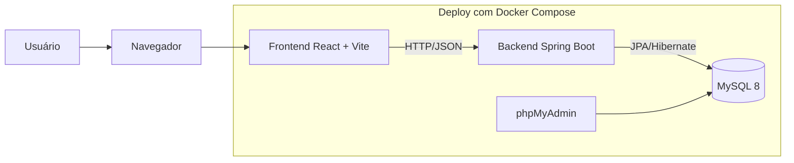

<div align="center">
	
</div>

# CampuShop - Seu Marketplace Estudantil

O **CampuShop** conecta estudantes que querem comprar e vender produtos de forma simples e segura dentro da comunidade acadêmica.

Em vez de procurar em vários grupos e chats, a ideia é ter tudo em um só lugar: cadastro, vitrine de produtos, carrinho, pedidos, chat, avaliações e autenticação.

## 🛠️ Tecnologias

- **Backend:** Java 17, Spring Boot 3, Spring Security, Spring Data JPA
- **Frontend:** React 18, TypeScript, Vite, Tailwind CSS
- **Banco de Dados:** MySQL 8
- **Ferramentas de Deploy:** Docker, Docker Compose

## 🧩 Visão geral

Pense no sistema como uma feira universitária organizada:

- **Usuário** = estudante com identificação (RA, email)
- **Produto** = item anunciado por um estudante
- **Carrinho** = cesta temporária para decidir o que comprar
- **Pedido** = compra finalizada
- **Itens** = detalhamento de cada produto dentro do carrinho/pedido

Assim, o banco de dados funciona como o "caderno oficial" da feira: guarda quem vende, quem compra, o que foi anunciado e o que foi comprado.

## 🏗️ Arquitetura do Sistema

No CampuShop, a arquitetura segue uma separação clara entre camadas e responsabilidades:

- **Cliente (Frontend):** interface React responsável pela experiência do usuário.
- **Aplicação (Backend):** API Spring Boot que centraliza regras de negócio, autenticação e integração com dados.
- **Persistência (Banco):** MySQL para armazenamento estruturado e consistente das informações.
- **Orquestração (Deploy):** Docker Compose para padronizar e simplificar execução local e em produção.

Essa organização reduz acoplamento, facilita manutenção, melhora escalabilidade e torna o processo de deploy mais previsível.

### Representação visual da arquitetura



## 🗄️ Banco de Dados

Esta seção descreve o modelo ER enviado no diagrama, de forma simples e direta.

### Entidades principais

- `USUARIO`: guarda os dados do cliente/vendedor com `id`, `email`, `cidade`, `nomeCliente`, `senha`, `telefone`, `tipo_conta`, `tipo_cliente`, `cpf_cnpj`, `instituicao_ensino`, `localizacao_gps`, `ativado` e `data_cadastro`.
- `PRODUTO`: armazena os anúncios com `idProduto`, `nome_produto`, `nome_amigavel`, `descricao`, `estoque`, `preco`, `dimensoes`, `imagem_blob`, `status`, `idCategoria` e `idVendedor`.
- `CATEGORIA`: classifica os produtos por `nome_categoria` e `descricao`.
- `VARIANTEPRODUTO`: representa variações do produto, com `nome_variante`, `preco_adicional` e `estoque_variante`.
- `CARRINHO`: registra itens adicionados ao carrinho com `id`, `idUsuario`, `idProduto`, `quantidade` e `data_adicao`.
- `PEDIDO`: registra a compra finalizada com `idPedido`, `data_pedido`, `valor_total`, `status_pedido`, `idCliente` e `idTipoPagamento`.
- `ITEMPEDIDO`: detalha os itens do pedido, com `idPedido`, `idProduto`, `quantidade`, `preco_unitario` e `subtotal`.
- `TIPOPAGAMENTO`: identifica a forma de pagamento, com `nome_tipo` e `descricao`.
- `CHAT`: armazena mensagens com `id`, `idRemetente`, `idDestinatario`, `idProduto`, `mensagem`, `data_hora` e `lida`.
- `AVALIACAO`: guarda avaliações com `id`, `idProduto`, `idUsuario`, `nota`, `comentario` e `data_avaliacao`.

### Como as tabelas se relacionam

- Um `USUARIO` vende produtos em `PRODUTO` (via `idVendedor`).
- Um `PRODUTO` pertence a uma `CATEGORIA` (via `idCategoria`).
- Um `PRODUTO` pode possuir várias linhas em `VARIANTEPRODUTO`.
- Um `USUARIO` adiciona produtos no `CARRINHO`.
- Um `USUARIO` realiza `PEDIDO` (via `idCliente`).
- Cada `PEDIDO` recebe um `TIPOPAGAMENTO` (via `idTipoPagamento`).
- Cada `PEDIDO` contém vários registros em `ITEMPEDIDO`.
- Cada `ITEMPEDIDO` referencia um `PRODUTO` e compõe o total do pedido.
- `CHAT` relaciona remetente e destinatário (`USUARIO`) e pode referenciar um `PRODUTO`.
- `AVALIACAO` liga `USUARIO` e `PRODUTO` para registrar nota e comentário.

### Diagrama ER (DER)

<div align="center">
	
</div>

## 📁 Scripts de BD

Os scripts ficam em `db/scripts` e seguem ordem numérica:

1. `db/scripts/001_schema.sql` → cria a estrutura base do banco, seguindo o ER.
2. `db/scripts/002_seed.sql` → insere dados iniciais para testes e demonstração.
3. `db/scripts/003_validate.sql` → valida a implantação depois da criação das tabelas.
4. `db/scripts/999_rollback.sql` → remove a estrutura para limpeza ou recomeço.

## 📌 Pré-requisitos

### Para rodar com Docker (recomendado)

- Docker Desktop instalado e em execução
- `docker compose` disponível no terminal
- Portas livres: `3306` (MySQL), `8080` (aplicação), `8081` (phpMyAdmin)

### Para rodar sem Docker (opcional)

- Java 17
- Maven 3.9+
- Node.js 18+ e npm
- MySQL 8 em execução

## 🚀 Guia prático de execução (Docker)

### 1. Ir para a raiz do projeto

```powershell
cd <CAMINHO_DO_PROJETO>/CAMPUSHOP
```

### 2. Subir serviços

```powershell
docker compose up -d --build
docker compose ps
```

### 3. Aplicar scripts SQL versionados

```powershell
docker cp .\db\scripts\001_schema.sql campushop-mysql:/tmp/001_schema.sql
docker compose exec mysql sh -c "mysql -uroot -p$MYSQL_ROOT_PASSWORD < /tmp/001_schema.sql"

docker cp .\db\scripts\002_seed.sql campushop-mysql:/tmp/002_seed.sql
docker compose exec mysql sh -c "mysql -uroot -p$MYSQL_ROOT_PASSWORD < /tmp/002_seed.sql"

docker cp .\db\scripts\003_validate.sql campushop-mysql:/tmp/003_validate.sql
docker compose exec mysql sh -c "mysql -uroot -p$MYSQL_ROOT_PASSWORD < /tmp/003_validate.sql"
```

### 4. Acessar serviços

- Aplicação: `http://localhost:8080`
- phpMyAdmin: `http://localhost:8081`

No phpMyAdmin, use:

- Servidor: `mysql`
- Usuário: `root`
- Senha: valor de `MYSQL_ROOT_PASSWORD` definido no `docker-compose.yml`

> ⚠️ Segurança: as credenciais atuais são de ambiente local/desenvolvimento. Para qualquer ambiente compartilhado ou produção, altere usuário/senha e não versione segredos reais.

## ✅ Validação rápida

1. Confirmar estado dos containers:

```powershell
docker compose ps
```

2. Executar conferência básica no banco:

```powershell
docker compose exec mysql sh -c "mysql -uroot -p$MYSQL_ROOT_PASSWORD -e \"USE campushop; SHOW TABLES; SELECT COUNT(*) AS usuarios FROM usuario; SELECT COUNT(*) AS produtos FROM produto;\""
```

3. Validar funcionalmente:

- abrir `http://localhost:8080`
- validar cadastro/login e listagem de produtos
- abrir `http://localhost:8081` (phpMyAdmin)

## ♻️ Rollback / Limpeza

Para remover estrutura e dados do banco:

1. Executar `db/scripts/999_rollback.sql` no MySQL
2. Opcional: remover volumes para reset total

```powershell
docker compose down -v
```

## 📦 Guia de execução sem Docker (opcional)

### 1. Backend

```powershell
mvn spring-boot:run
```

Backend/API: `http://localhost:8080`

### 2. Frontend (hot reload)

```powershell
cd frontend
npm install
npm run dev
```

Frontend (dev): `http://localhost:5173`

> Observação: no modo sem Docker, você precisa garantir que o banco MySQL local esteja configurado para as mesmas credenciais/propriedades esperadas pela aplicação.

## 📂 Estrutura essencial

- `src/main/java` → código backend
- `src/main/resources` → templates e arquivos estáticos servidos pelo Spring
- `frontend` → código-fonte React
- `db/scripts` → scripts SQL versionados
- `docker-compose.yml` → orquestração de app + banco

---

Projeto desenvolvido por **Caio, Jhonathas, Julia, Pedro e Mateus**.
